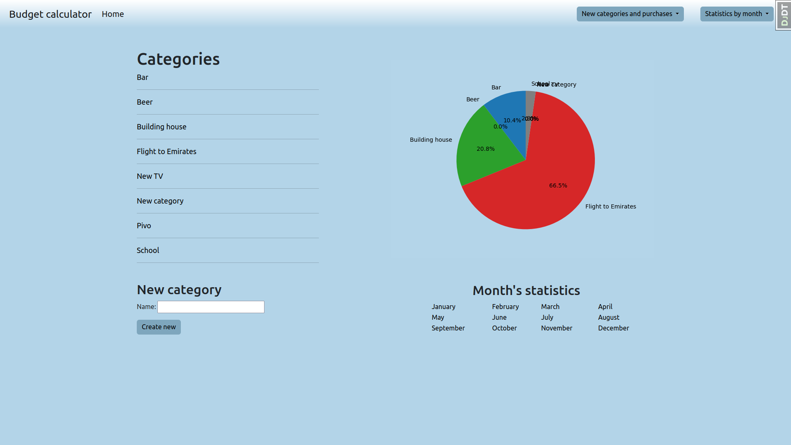
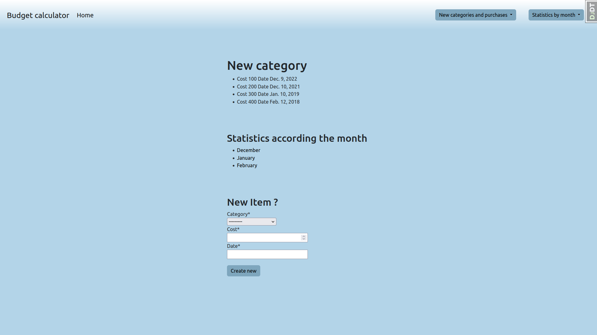
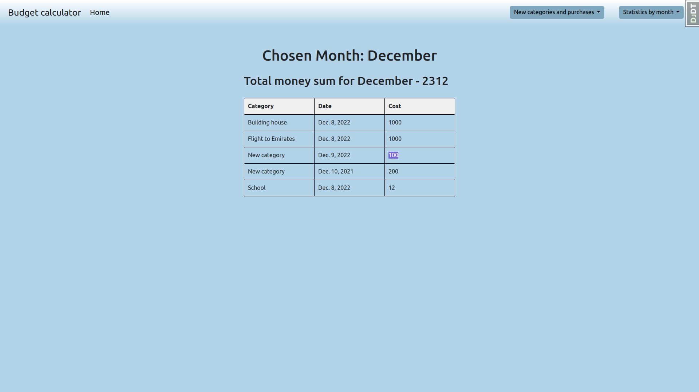
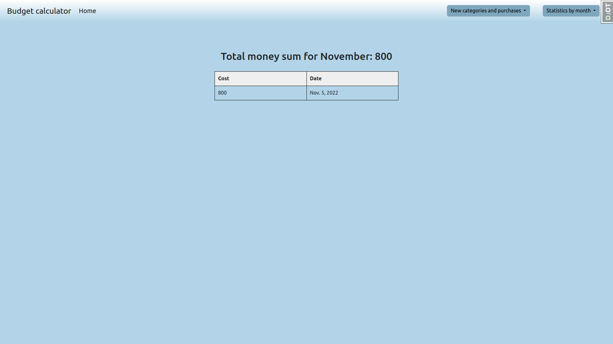

# The Budget Calculator project ##

## Already done

- Created application that provides you with opportunity of managing your budget
- The statistic is divided on years. Under the year layer you can get the statistic per month or per category of expense
- Under the year layer you can get the visual interpretation of your budget statistic in the form of pie
- Showing the statistic only for authorized users

## Used technologies

- Python, Django
- PostgreSQL
- Docker
- HTML, CSS, Bootstrap 5
- Poetry, Matplotlib

## How to install
    $ git clone https://github.com/PashaDem/BudgetCalculator.git

    # go to the cloned directory
    $ python3 -m venv venv
    
    # activating venv on linux
    $ source ./venv/bin/activate

    $ pip install -r requirements.txt

    # Connecting migration to the database
    $ python manage.py migrate

    # start server on localhost
    $ python manage.py runserver
## New Ideas to implement: ##
##### - Implement some other diagrams(f.e. the graph of the purchases of the category per the year) #####
##### - Add authentication system #####
##### - Create Api for this application #####
##### - Implement logging #####
##### - Style the forms with crispy forms #####
##### - Change the database #####
##### - Dockerize the app #####
##### - Implement pagination #####
##### - Correcting git repo (.gitignore)
## Existing functionality ##
### The main page that represents the statistics of purchases ###

### The page with statistics related to the category and category with month ###

### Statistics by month ###

### Statistics by month and category ###

